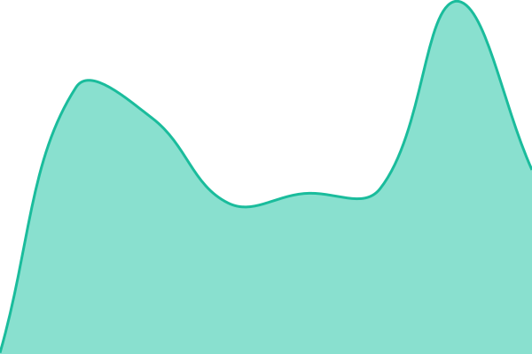

# [📈 Live Status](https://upptime.github.io/upptime): <!--live status--> **🟩 All systems operational**

This repository contains the open-source uptime monitor and status page for [Upptime](https://upptime.js.org), powered by [Upptime](https://github.com/upptime/upptime).

With [Upptime](https://upptime.js.org), you can get your own unlimited and free uptime monitor and status page, powered entirely by a GitHub repository. We use [Issues](https://github.com/upptime/upptime/issues) as incident reports, [Actions](https://github.com/kinghua0629/upptime/actions) as uptime monitors, and [Pages](https://upptime.github.io/upptime) for the status page.

<!--start: status pages-->
<!-- This summary is generated by Upptime (https://github.com/upptime/upptime) -->
<!-- Do not edit this manually, your changes will be overwritten -->
<!-- prettier-ignore -->
| URL | Status | History | Response Time | Uptime |
| --- | ------ | ------- | ------------- | ------ |
|  [My landing page](https://oscarhua0629.com) | 🟩 Up | [my-landing-page.yml](https://github.com/kinghua0629/upptime/commits/HEAD/history/my-landing-page.yml) | 

 142ms
     
 | 

<a href="https://status.kinghua0629.com/history/my-landing-page">100.00%</a>
    

|  [My blog](https://kinghua0629.com) | 🟩 Up | [my-blog.yml](https://github.com/kinghua0629/upptime/commits/HEAD/history/my-blog.yml) | 

 224ms
     
 | 

<a href="https://status.kinghua0629.com/history/my-blog">100.00%</a>
    

|  [My discussion site](https://discussion.kinghua0629.com) | 🟩 Up | [my-discussion-site.yml](https://github.com/kinghua0629/upptime/commits/HEAD/history/my-discussion-site.yml) | 

 267ms
     
 | 

<a href="https://status.kinghua0629.com/history/my-discussion-site">100.00%</a>
    

|  [My temporary email](https://mail.kinghua0629.com) | 🟩 Up | [my-temporary-email.yml](https://github.com/kinghua0629/upptime/commits/HEAD/history/my-temporary-email.yml) | 

 234ms
     
 | 

<a href="https://status.kinghua0629.com/history/my-temporary-email">100.00%</a>
    

|  [My Tech Blog](https://blog.kinghua0629.com) | 🟩 Up | [my-new-tech-blog.yml](https://github.com/kinghua0629/upptime/commits/HEAD/history/my-new-tech-blog.yml) | 

 162ms
     
 | 

<a href="https://status.kinghua0629.com/history/my-new-tech-blog">100.00%</a>
    

<!--end: status pages-->

[**Visit our status website →**](https://upptime.github.io/upptime)

## 📄 License

- Powered by: [Upptime](https://github.com/upptime/upptime)
- Code: [MIT](./LICENSE) © [Anand Chowdhary](https://anandchowdhary.com), supported by [Pabio](https://pabio.com)
- Data in the `./history` directory: [Open Database License](https://opendatacommons.org/licenses/odbl/1-0/)
